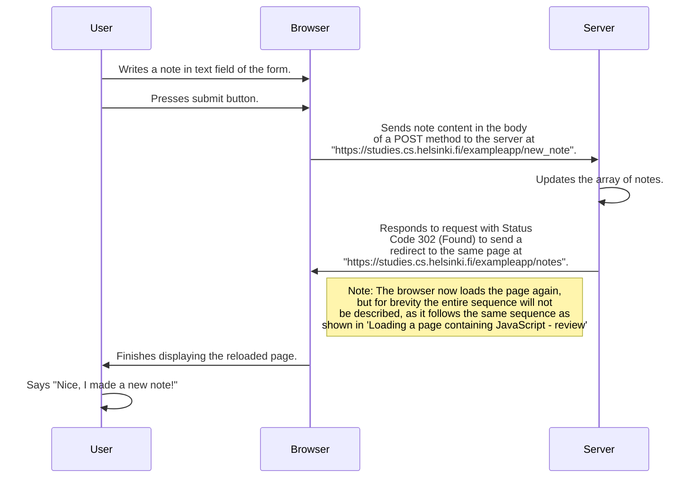

# 0.4 New Note

```mermaid
sequenceDiagram
participant User
participant Browser
participant Server
User->>Browser: Writes a note in text field of the form.
User->>Browser: Presses submit button.
Browser->>Server: Sends note content in the body<br> of a POST method to the server at <br>"https://studies.cs.helsinki.fi/exampleapp/new_note".
Server->>Server: Updates the array of notes.
Server->>Browser: Responds to request with Status<br> Code 302 (Found) to send a<br> redirect to the same page at <br>"https://studies.cs.helsinki.fi/exampleapp/notes".
Note right of Browser: Note: The browser now loads the page again,<br>but for brevity the entire sequence will not<br>be described, as it follows the same sequence as<br> shown in 'Loading a page containing JavaScript - review'
Browser->>User: Finishes displaying the reloaded page.
User->>User: Says "Nice, I made a new note!"
```
