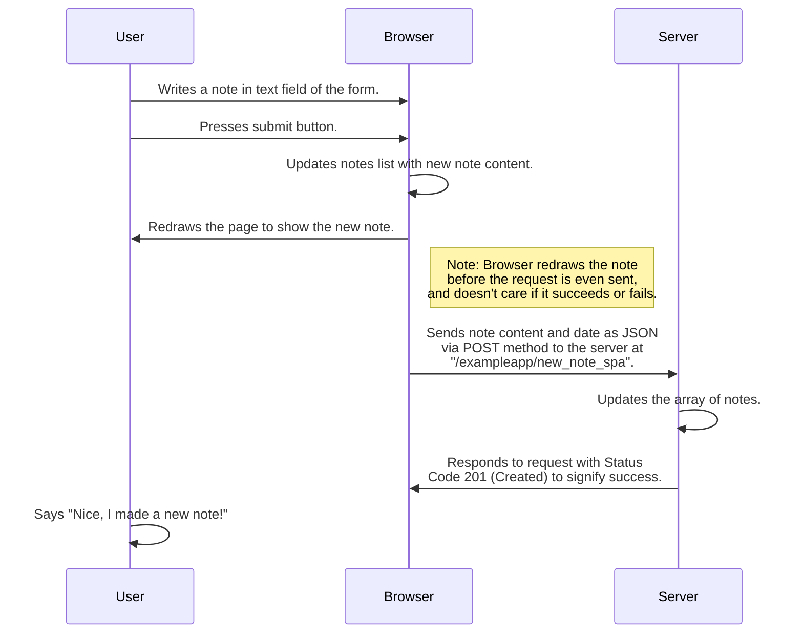

# 0.6 New Note in Single Page App Diagram

```mermaid
sequenceDiagram
participant User
participant Browser
participant Server
User->>Browser: Writes a note in text field of the form.
User->>Browser: Presses submit button.
Browser->>Browser: Updates notes list with new note content.
Browser->>User: Redraws the page to show the new note.
Note right of Browser: Note: Browser redraws the note<br> before the request is even sent, <br>and doesn't care if it succeeds or fails.
Browser->>Server: Sends note content and date as JSON<br> via POST method to the server at <br> "/exampleapp/new_note_spa".
Server->>Server: Updates the array of notes.
Server->>Browser: Responds to request with Status<br> Code 201 (Created) to signify success.
User->>User: Says "Nice, I made a new note!"
```
